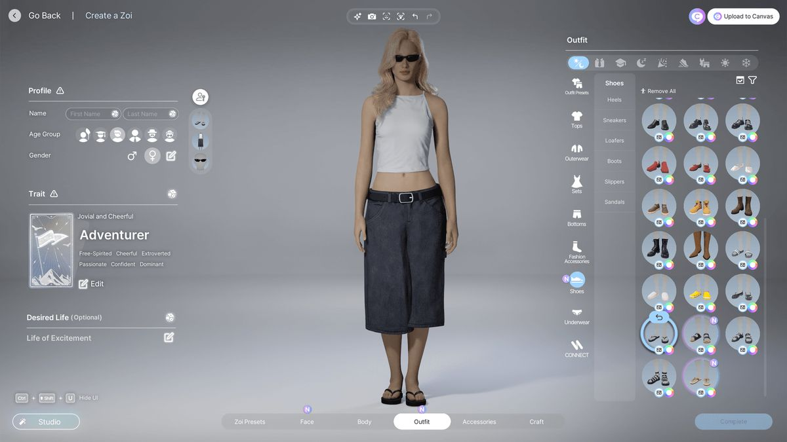

# FreeStyle



FreeStyle is now a mannequin-first wardrobe product. The main experience is no longer old shopping-link import or AI try-on experimentation. The product is organized around a real-time 3D human fitting flow:

1. Enter body measurements and body-frame traits.
2. Map those measurements into a rig-aware mannequin runtime.
3. Dress the mannequin in real time, rotate, zoom, and change pose.
4. Move garments and items into a styling canvas.
5. Keep the whole app visually aligned to the wardrobe reference image above.

## Main IA

- `Home` at `/`
- `Closet` at `/app/closet`
- `Canvas` at `/app/canvas`
- `Community` at `/app/community`
- `Profile` at `/app/profile`

`Fitting` is no longer a standalone surface. It now lives inside `Closet`, and `/app/fitting` only remains as a compatibility redirect to `/app/closet`.
`/app/discover` still resolves, but only as a compatibility redirect to `/app/community`.
`/app/lab` still exists, but it is quarantined as experimental. It is not part of the main product flow.

## Product, Admin, Legacy, Lab

The repository is now split into four runtime surfaces:

- `Product`: `/v1/*`
  - `/v1/profile/body-profile`
  - `/v1/closet/items`
  - `/v1/closet/runtime-garments`
  - `/v1/canvas/looks`
  - `/v1/community/looks`
- `Admin`: `/v1/admin/*`
  - `POST /v1/admin/garments`
  - `/v1/admin/garments`
- `Legacy`: `/v1/legacy/*`
  - old import/assets/outfits/widget APIs
  - response header `x-freestyle-surface: legacy`
  - response header `deprecation: true`
- `Lab`: `/v1/lab/*`
  - evaluation and try-on experiments
  - response header `x-freestyle-surface: lab`

Main web surfaces should use product routes only. Admin is an operational publishing surface, not part of public product navigation. Legacy and lab are isolated on purpose.
`/app/lab/viewer-platform` is now reserved for the Phase 1 browser harness that exercises `viewer-core + viewer-react` directly without making it a main product path.

Current fit-specific contract split:

- `/v1/admin/garments*` remains the publication-focused runtime-garment boundary
- `/v1/closet/runtime-garments` is the product-facing closet catalog boundary and now returns `{ item, instantFit }` entries seeded from the current persisted body profile

## Current Runtime Status

The shipped runtime now uses:

- rigged human GLB base bodies
- a body-profile normalization layer
- MPFB shape-key morph targets plus rig-target transforms driven by measurements
- garment runtime bindings with anchors, collision zones, body masks, and render order
- pose control and quality tiers
- meshopt-compressed runtime GLBs with WebP-compressed textures for shipped browser assets
- `viewer-core` shared loader policy with committed DRACO + KTX2 transcoder public assets under `apps/web/public/draco` and `apps/web/public/basis`
- a non-blocking Phase 3 asset-budget report at `output/asset-budget-report/latest.json`
- selective preload of the active avatar and nearby closet assets instead of whole-catalog eager preload

Preferred authoring policy is:

- `MPFB2 / MakeHuman` first
- `CharMorph` fallback
- Blender only as offline authoring/export tooling
- web runtime output as `glb` or `gltf`

Important: the repo now ships MPFB2-authored base avatar GLBs with exported body morph targets, MPFB starter garment GLBs generated from the official `shirts01 / pants01 / shoes01` packs, runtime accessories, and eight selectable runtime hair GLBs. The current runtime also includes a lightweight secondary-motion layer for long hair and loose hero garments, so `Closet` can communicate sway and drape without paying the cost of full browser cloth simulation. The remaining gap is no longer “missing mannequin assets”; it is quality tuning: measurement-to-morph calibration still needs tighter fit against the real MPFB shape-key space, and the hero catalog still needs deeper corrective refinement to consistently read as a high-end try-on experience. That state is documented explicitly in [docs/avatar-pipeline.md](docs/avatar-pipeline.md).
The repo now also ships a representative archetype review layer for partner publishing: `apps/admin` previews fit across multiple body archetypes before save, and `npm run validate:fit-calibration` writes a starter-catalog fit matrix report plus the committed MPFB avatar reference-baseline snapshot to `output/fit-calibration/latest.json`.
`Phase 3` of the deep-research runtime plan now has a formal interactive-preview seam: the browser stage selects `static-fit`, `cpu-reduced`, or same-origin `worker-reduced` preview backends from one shared policy, and uses typed preview-frame messaging plus demand-driven invalidation for long-hair / loose-garment motion. This is still a reduced preview baseline, not solver-grade cloth truth.
`Phase D` now also has an active offline HQ-fit artifact pipeline: `POST /v1/lab/jobs/fit-simulations` queues `fit_simulate_hq_v1`, the runtime worker processes it asynchronously, and the current artifact bundle is `draped_glb + fit_map_json + preview_png + metrics_json`. `Closet` now consumes that path directly through an HQ-fit panel that can request a run, poll the persisted record, render the generated `preview_png`, and open the ordered artifact bundle. The current `draped_glb` is still an authored-scene merge baseline for artifact/persistence/swap-in plumbing, not a claim that solver-deformed cloth truth is already solved.
`Phase 5` of the deep-research runtime plan now has a committed visual-regression and release-hardening seam: Playwright route goldens cover `Home`, `Canvas`, `Community`, `Profile`, plus `Closet` low / balanced / high quality tiers, and the release docs now treat those snapshots as RC evidence instead of ad-hoc operator screenshots only.

## Monorepo Structure

```txt
apps/admin               Next.js admin publishing surface with guided garment create/update workflow
apps/web                 Next.js product shell and routes
apps/api                 Fastify API with product / legacy / lab namespaces
workers/runtime          background worker runtime
packages/design-tokens   visual tokens from the wardrobe reference language
packages/domain-avatar   body profile normalization and avatar mapping
packages/domain-garment  garment runtime contract and starter closet data
packages/domain-canvas   canvas composition models and persistence helpers
packages/runtime-3d      R3F stage runtime, avatar manifest, asset budgets
packages/asset-schema    production-grade asset, material, and fit-artifact schemas
packages/viewer-core     imperative viewer lifecycle, renderer ownership, and shared loader registry seam
packages/viewer-react    canonical product-facing viewer adapter; owns host selection, preload delegation, fallback/retry lifecycle, and forwards scene updates across the staged cutover seam
packages/viewer-protocol typed viewer commands, worker messages, and artifact envelopes
packages/fit-kernel      preview solver execution-mode and transport seam
packages/ui              shared wardrobe UI primitives
packages/shared-types    canonical product types
packages/shared-utils    shared helpers
packages/contracts       supporting API/widget contracts kept outside the core product domains
plugins/blender          repo-local Blender Codex plugin source, skills, and installer
.agents/plugins          repo-local plugin marketplace metadata for Codex
```

## What Changed In This Realignment

- Old duplicate root trees `src/` and `public/` were removed.
- Main navigation was rebuilt around `Closet / Canvas / Community / Profile`, with a public Home at `/`.
- Legacy public routes such as `/studio`, `/trends`, `/examples`, `/how-it-works`, `/app/looks`, `/app/decide`, `/app/journal`, and `/profile` were redirected or removed from the main IA.
- Large legacy feature trees were deleted or quarantined.
- The product shell was rebuilt around the supplied wardrobe reference image:
  - centered mannequin stage
  - slim translucent side rails
  - floating top micro-toolbar
  - bottom segmented mode bar
  - neutral gray and white glass surfaces
- A real public home surface now exists at `/` instead of redirecting directly into `Closet`.

See [docs/migration-notes.md](docs/migration-notes.md) for the detailed deletion and quarantine log.

## Persistence Model

Current persistence is intentionally split by boundary:

- local repositories for body profile, closet scene, and canvas compositions
- admin-published runtime garments can use a file-backed local fallback or a Supabase-backed publication store behind the same API port
- product API namespace ready for remote persistence adapters
- normalized payloads that preserve compatibility with older flat `bodyProfile` storage

The current local-first repositories are in:

- `packages/domain-avatar`
- `packages/domain-canvas`
- `apps/api/src/modules/*`

## Development

```bash
npm install
npm run dev
```

Useful commands:

- `npm run dev`
- `npm run dev:admin`
- `npm run dev:api`
- `npm run dev:worker`
- `npm run viewer:sync:transcoders`
- `npm run report:asset-budget`
- `npm run build:display-asset`
- `npm run encode:ktx2 -- --input <texture>`
- `npm run generate:lods -- --input <asset.glb>`
- `npm run optimize:runtime:assets`
- `npm run check`
- `npm run validate:garment3d`

Codex desktop note:

- when native modules such as `sharp`, `lightningcss`, or `@next/swc` fail under the bundled app Node, rerun build/test commands with `PATH=/opt/homebrew/bin:$PATH`

Admin local setup:

- copy `apps/admin/.env.example` to `apps/admin/.env.local`
- point `BACKEND_ORIGIN` and `NEXT_PUBLIC_API_BASE_URL` to the Railway API origin
- set the Supabase browser auth variables before running `npm run dev:admin`

Repo-local Codex plugin work lives under `plugins/`, and plugin ordering metadata lives in `.agents/plugins/marketplace.json`.
The current Blender plugin source is `plugins/blender`; run `python3 plugins/blender/scripts/install_global_blender_plugin.py` to sync the global plugin copy, skill links, and the `blender` MCP server.

## Quality Gate

CI requires all of the following:

- `npm run lint`
- `npm run typecheck`
- `npm run typecheck:admin`
- `npm run test:core`
- `npm run validate:garment3d`
- `npm run validate:avatar3d`
- `npm run validate:fit-calibration`
- `npm run build:services`
- `npm run build`
- `npm run build:admin`

## Core Documents

If any document under `docs/replatform-v2/**`, `docs/RENEWAL_*`, or older health reports disagrees with the files below, use the files below as the current source of truth.

- [docs/freestyle-improvement-status.md](docs/freestyle-improvement-status.md)
- [docs/PERFECT_FITTING_EXECUTION_PLAN.md](docs/PERFECT_FITTING_EXECUTION_PLAN.md)
- [docs/architecture-overview.md](docs/architecture-overview.md)
- [docs/repo-inventory.md](docs/repo-inventory.md)
- [docs/product-boundaries.md](docs/product-boundaries.md)
- [docs/contract-ownership.md](docs/contract-ownership.md)
- [docs/ai-agent-playbook.md](docs/ai-agent-playbook.md)
- [docs/quality-gates.md](docs/quality-gates.md)
- [docs/freestyle-viewer-platform/phase1/closeout.md](docs/freestyle-viewer-platform/phase1/closeout.md)
- [docs/freestyle-viewer-platform/phase2/closeout.md](docs/freestyle-viewer-platform/phase2/closeout.md)
- [docs/freestyle-viewer-platform/phase2/telemetry-slice.md](docs/freestyle-viewer-platform/phase2/telemetry-slice.md)
- [docs/freestyle-viewer-platform/phase2/manifest-shadow.md](docs/freestyle-viewer-platform/phase2/manifest-shadow.md)
- [docs/freestyle-viewer-platform/phase2_5/closeout.md](docs/freestyle-viewer-platform/phase2_5/closeout.md)
- [docs/freestyle-viewer-platform/phase3/batch1.md](docs/freestyle-viewer-platform/phase3/batch1.md)
- [docs/asset-quality-contract.md](docs/asset-quality-contract.md)
- [docs/avatar-production-contract.md](docs/avatar-production-contract.md)
- [docs/garment-production-contract.md](docs/garment-production-contract.md)
- [docs/material-contract.md](docs/material-contract.md)
- [docs/fit-quality-contract.md](docs/fit-quality-contract.md)
- [docs/avatar-pipeline.md](docs/avatar-pipeline.md)
- [docs/garment-fitting-contract.md](docs/garment-fitting-contract.md)
- [docs/physical-fit-system.md](docs/physical-fit-system.md)
- [docs/admin-asset-publishing.md](docs/admin-asset-publishing.md)
- [docs/design-system.md](docs/design-system.md)
- [docs/migration-notes.md](docs/migration-notes.md)
- [docs/DEVELOPMENT_GUIDE.md](docs/DEVELOPMENT_GUIDE.md)
- [docs/MAINTENANCE_PLAYBOOK.md](docs/MAINTENANCE_PLAYBOOK.md)
- [docs/TECH_WATCH.md](docs/TECH_WATCH.md)
- [docs/OPEN_ASSET_CREDITS.md](docs/OPEN_ASSET_CREDITS.md)
