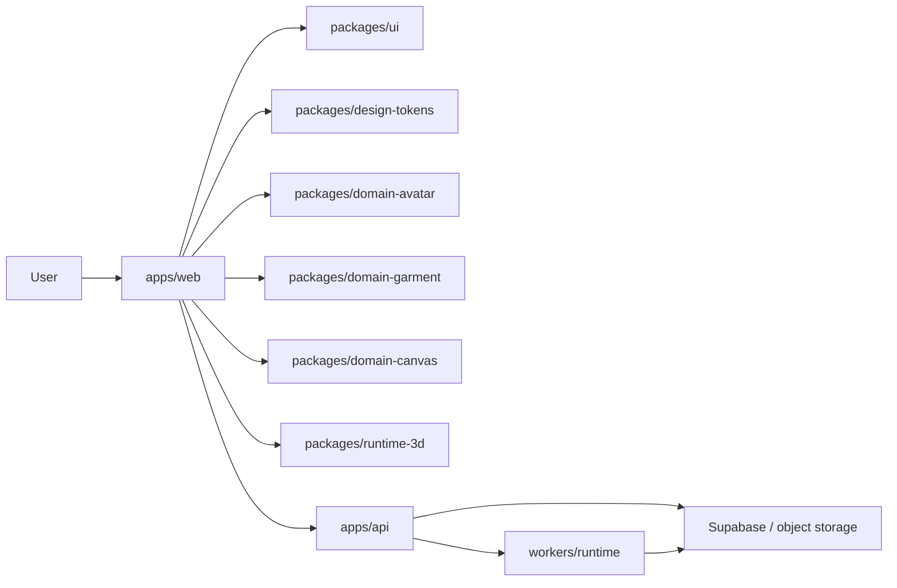

# Architecture Overview

## 1. Product Intent

The repository now reads as a mannequin-based 3D fitting and styling product. The main loop is:

1. capture a body profile
2. map it into avatar control space
3. render and dress a rigged human mannequin
4. save and remix looks inside a canvas workflow

Old import, basket, AI evaluation, and AI try-on features no longer define the product. They are either deprecated or quarantined.

## 2. System Diagram



## 3. Runtime Surfaces

### Product

- route prefix: `/v1`
- purpose: body profile, closet, canvas, community, auth bridge
- UI exposure: main product only

### Legacy

- route prefix: `/v1/legacy`
- purpose: deprecated import/assets/outfits/widget flows
- UI exposure: redirected or secondary only
- response headers: `x-freestyle-surface: legacy`, `deprecation: true`

### Lab

- route prefix: `/v1/lab`
- purpose: experiments such as evaluation and try-on
- UI exposure: isolated and non-primary
- response header: `x-freestyle-surface: lab`

## 4. Package Dependency Shape

The intended direction is:

```txt
shared-types/shared-utils
  -> design-tokens
  -> ui
  -> domain-avatar / domain-garment / domain-canvas
  -> runtime-3d
  -> apps/web
  -> apps/api
```

Rules:

- `apps/web` orchestrates only
- `runtime-3d` owns scene mutation
- domain packages own logic and persistence helpers
- shared packages do not import app code

## 5. Route Map

Main navigation:

- `/`
- `/app/closet`
- `/app/fitting`
- `/app/canvas`
- `/app/community`
- `/app/profile`

Redirect quarantine:

- `/studio`
- `/trends`
- `/examples`
- `/how-it-works`
- `/profile`
- `/app/looks*`
- `/app/decide*`
- `/app/journal*`
- `/app/discover*`

Source-of-truth files:

- `apps/web/route-map.mjs`
- `apps/web/src/lib/product-routes.ts`

## 6. State Boundaries

### Body profile

- canonical type: `BodyProfile`
- source package: `packages/shared-types`
- domain logic: `packages/domain-avatar`
- runtime application: `packages/runtime-3d`

### Closet scene

- avatar variant
- pose
- active category
- equipped garments
- quality tier

### Canvas composition

- saved title and stage color
- normalized body profile snapshot
- closet scene snapshot
- positioned garment items

## 7. Avatar Runtime Contract

Current code-level source-of-truth:

- `packages/runtime-3d/src/avatar-manifest.ts`
- `packages/domain-garment/src/skeleton-profiles.ts`

Key expectations:

- humanoid skeleton
- Y-up meter units
- A-pose bind state
- alias-based bone mapping
- mesh segmentation for torso, legs, feet
- anchor-compatible garment attachment

## 8. Persistence Architecture

Current state:

- local-first repositories exist for body profile, closet scene, and canvas compositions
- API namespace and service boundaries are in place for remote persistence

This is intentional. The UI and scene runtime are already separated from persistence so remote adapters can replace local storage without rewriting pages.

## 9. Implementation Status

| Area | Status | Notes |
| --- | --- | --- |
| Product IA reset | Implemented | Main nav now targets Closet, Fitting, Canvas, Community, Profile, with a public Home at `/`. |
| Legacy route quarantine | Implemented | Redirect map is active and dead route files were removed. |
| Domain package split | Implemented | Avatar, garment, canvas, UI, tokens, runtime packages are live. |
| Product vs legacy vs lab API split | Implemented | Mounted in `apps/api/src/main.ts`. |
| Reference-driven shell layout | Implemented | `ProductAppShell` and surface panels follow the wardrobe composition. |
| Measurement-to-rig mapping | Implemented | `bodyProfileToAvatarParams` and `avatarParamsToRigTargets` are live. |
| Garment runtime contract | Implemented | skeleton profile registry, runtime bindings, and tests exist. |
| MPFB2-authored shipping mannequin | Partial | Policy and runtime boundary exist, but shipped asset is still fallback GLB-based. |

## 10. Superseded Docs

`docs/architecture.md` is now an archive pointer. Use this file as the current architecture source.
