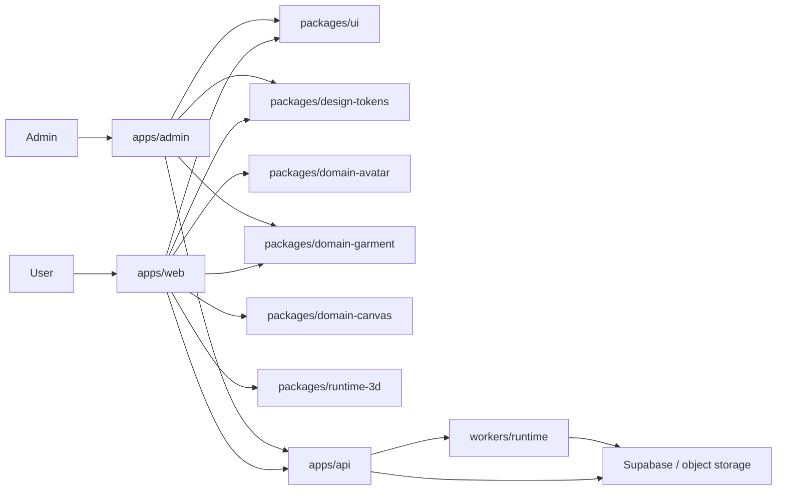

# Architecture Overview

## 1. Product Intent

The repository now reads as a mannequin-based 3D fitting and styling product. The main loop is:

1. capture a body profile
2. map it into avatar control space
3. render and dress a rigged human mannequin
4. save and remix looks inside a canvas workflow

Old import, basket, AI evaluation, and AI try-on features no longer define the product. They are either deprecated or quarantined.

## 2. System Diagram



## 3. Runtime Surfaces

### Product

- route prefix: `/v1`
- purpose: body profile, closet, canvas, community, auth bridge
- UI exposure: main product only

### Legacy

- route prefix: `/v1/legacy`
- purpose: deprecated import/assets/outfits/widget flows
- UI exposure: redirected or secondary only
- response headers: `x-freestyle-surface: legacy`, `deprecation: true`

### Lab

- route prefix: `/v1/lab`
- purpose: experiments such as evaluation and try-on
- UI exposure: isolated and non-primary
- response header: `x-freestyle-surface: lab`

## 4. Package Dependency Shape

The intended direction is:

```txt
shared-types/shared-utils
  -> design-tokens
  -> ui
  -> domain-avatar / domain-garment / domain-canvas
  -> runtime-3d
  -> apps/admin
  -> apps/web
  -> apps/api
```

Rules:

- `apps/admin` owns internal garment publication workflows only
- `apps/web` orchestrates only
- `packages/runtime-3d` owns the shared avatar manifest and reusable scene contract
- `packages/runtime-3d/src/closet-stage.tsx` is the current live `Closet` stage implementation
- `packages/runtime-3d/src/runtime-gltf-loader.ts` owns shared runtime decoder setup for both live stage loads and preloads
- domain packages own logic and persistence helpers
- shared packages do not import app code

## 5. Route Map

Main navigation:

- `/`
- `/app/closet`
- `/app/canvas`
- `/app/community`
- `/app/profile`

Compatibility redirect:

- `/app/fitting -> /app/closet`

Redirect quarantine:

- `/studio`
- `/trends`
- `/examples`
- `/how-it-works`
- `/profile`
- `/app/looks*`
- `/app/decide*`
- `/app/journal*`
- `/app/discover*`

Source-of-truth files:

- `apps/web/route-map.mjs`
- `apps/web/src/lib/product-routes.ts`

## 6. State Boundaries

### Body profile

- canonical type: `BodyProfile`
- source package: `packages/shared-types`
- domain logic: `packages/domain-avatar`
- runtime application: `packages/runtime-3d`

### Closet scene

- avatar variant
- pose
- active category
- equipped garments
- quality tier
- live stage renderer: `packages/runtime-3d/src/closet-stage.tsx`
- shared runtime preload/model-path helpers: `packages/runtime-3d/src/runtime-gltf-loader.ts`, `packages/runtime-3d/src/runtime-model-paths.ts`

### Canvas composition

- saved title and stage color
- normalized body profile snapshot
- closet scene snapshot
- positioned garment items
- contract source: `packages/contracts`
- repository boundary: `packages/domain-canvas`

## 7. Avatar Runtime Contract

Current code-level source-of-truth:

- `packages/runtime-3d/src/avatar-manifest.ts`
- `packages/domain-garment/src/skeleton-profiles.ts`

Key expectations:

- humanoid skeleton
- Y-up meter units
- A-pose bind state
- alias-based bone mapping
- mesh segmentation for torso, legs, feet
- anchor-compatible garment attachment

## 8. Persistence Architecture

Current state:

- local-first repositories exist for body profile, closet scene, and canvas compositions
- API namespace and service boundaries are in place for remote persistence

This is intentional. The UI and scene runtime are already separated from persistence so remote adapters can replace local storage without rewriting pages.

The first admin publishing boundary is now active through:

- `apps/admin`
- `POST /v1/admin/garments`
- `/v1/admin/garments`
- `/v1/closet/runtime-garments`

`apps/admin` is now the dedicated admin surface, with a guided create/update workflow for garment identity, exact size-chart rows, runtime binding, and raw manifest inspection. The API endpoints still use a local JSON repository so the public `Closet` surface can consume published runtime garments without being coupled to garment authoring logic.

## 9. Implementation Status

| Area | Status | Notes |
| --- | --- | --- |
| Product IA reset | Implemented | Main nav now targets Closet, Canvas, Community, and Profile, with a public Home at `/`. Fitting is absorbed into Closet. |
| Legacy route quarantine | Implemented | Redirect map is active and dead route files were removed. |
| Domain package split | Implemented | Avatar, garment, canvas, UI, tokens, runtime packages are live. |
| Product vs legacy vs lab API split | Implemented | Mounted in `apps/api/src/main.ts`. |
| Reference-driven shell layout | Implemented | `ProductAppShell` and surface panels follow the wardrobe composition. |
| Measurement-to-avatar plan mapping | Implemented | `bodyProfileToAvatarMorphPlan` now emits formal morph-target and rig-target plans for runtime application. |
| Garment runtime contract | Implemented | skeleton profile registry, runtime bindings, size-chart fields, and tests exist. |
| MPFB2-authored shipping mannequin | Partial | MPFB-authored base avatar GLBs now ship with exported body morph targets, and official MakeHuman starter garment GLBs now ship in-repo, but measurement calibration and garment coverage tuning are still below the final product bar. |

## 10. Current Runtime Reality

The current `Closet` stage now uses one canonical runtime:

- visible MPFB-authored avatar GLB variants from `packages/runtime-3d/src/avatar-manifest.ts`
- visible MPFB-authored garment GLBs rendered inside the same shared wrapper transform as the avatar
- formal body mapping path through `bodyProfileToAvatarMorphPlan`, with MPFB morph-target application active in runtime
- size-chart aware garment metadata with `measurementModes`, `sizeChart`, `selectedSizeLabel`, and `physicalProfile`
- physical fit assessment output from `packages/domain-garment/src/index.ts`
- merged runtime catalog support so `Closet` can consume published admin-domain garments in addition to starter assets

This is materially closer to the target architecture than the old proxy-driven stage, but it is still not the final avatar-quality state. The repo now ships real MPFB runtime assets, yet morph fidelity and garment coverage tuning still need another pass before the result reaches the intended “real person” bar.

## 11. Superseded Docs

`docs/architecture.md` is now an archive pointer. Use this file as the current architecture source.
